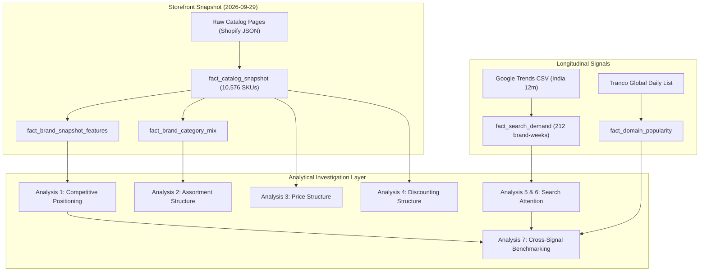

# BrandSignal Analytical Investigation

**Document Version:** 1.0.0  
**Snapshot Date:** `2026-09-29` (Catalog & Pricing)  
**Search Period:** `2025-09-28` to `2026-09-27` (53 weeks, Google Trends)  
**Scope:** Direct-to-Consumer Footwear Benchmark Cohort (India) — *Bacca Bucci, Elevar Sports, Neeman's, Plaeto*  
**Database Reference:** [`data/processed/brandsignal.duckdb`](file:///D:/BrandSignal/data/processed/brandsignal.duckdb)  
**Methodological Reference:** [`docs/methodology.md`](file:///D:/BrandSignal/docs/methodology.md)  

---

## 1. Executive Data Summary

This analytical investigation establishes empirical baselines across the four Indian footwear brands using strictly validated, non-synthetic data stored in DuckDB and Parquet layers. 

### Methodological Classification Framework
To maintain rigorous analytical discipline, all statements throughout this document are categorized into four epistemic categories:
1. **Observed Fact:** Direct, empirical measurements extracted from primary sources without mathematical transformation (e.g., raw SKU counts, raw listed prices, verbatim Google Trends values).
2. **Derived Comparison:** Deterministic statistical transformations computed across the cohort (e.g., cohort medians, Price Positioning Index, variant density, percentage differences).
3. **Limitation:** Inherent structural boundaries, temporal mismatches, data sparsity, or merchant conventions that constrain the analytical validity of the metric.
4. **Interpretation:** Objective, descriptive synthesis of observed patterns without causal claims, prescriptive strategy, or speculative assumptions.



### High-Level Empirical Footprint
* **Catalog Dataset:** 10,576 total active SKUs across 2,050 parent product styles collected on `2026-09-29`. Zero records were filtered, imputed, or dropped.
* **Search Dataset:** 212 brand-week observations across 53 weeks. Exactly 50 weeks have complete numeric coverage across all four brands where cohort relative search share is deterministically derived; 3 weeks contain `<1` unquantified values for low-volume brands.
* **Domain Popularity:** Neeman's (#83,301) and Bacca Bucci (#88,548) hold measurable global traffic positions within the Tranco Top 1 Million; Elevar Sports and Plaeto sit unranked outside the Top 1 Million.

---

## 2. Current Competitive Snapshot

The table below benchmarks the four brands as of the `2026-09-29` storefront snapshot across core assortment, pricing, and promotional metrics.

### Snapshot Comparison Table (Snapshot Date: `2026-09-29`)

| Metric | Bacca Bucci | Elevar Sports | Neeman's | Plaeto | Cohort Median |
| :--- | :---: | :---: | :---: | :---: | :---: |
| **Active Product Styles** | 1,077 | 287 | 628 | 58 | **457.5** |
| *Diff from Cohort Median* | *+619.5 (+135.4%)* | *-170.5 (-37.3%)* | *+170.5 (+37.3%)* | *-399.5 (-87.3%)* | — |
| **Active SKUs (Variants)** | 5,744 | 540 | 3,901 | 391 | **2,220.5** |
| *Diff from Cohort Median* | *+3,523.5 (+158.7%)* | *-1,680.5 (-75.7%)* | *+1,680.5 (+75.7%)* | *-1,829.5 (-82.4%)* | — |
| **Variant Density (SKUs/Style)** | 5.33 | 1.88 | 6.21 | 6.74 | **5.77** |
| *Diff from Cohort Median* | *-0.44 (-7.6%)* | *-3.89 (-67.4%)* | *+0.44 (+7.6%)* | *+0.97 (+16.8%)* | — |
| **Median Selling Price (INR)** | ₹1,499.00 | ₹2,300.00 | ₹1,999.00 | ₹1,799.00 | **₹1,899.00** |
| *Diff from Cohort Median* | *-₹400.00 (-21.1%)* | *+₹401.00 (+21.1%)* | *+₹100.00 (+5.3%)* | *-₹100.00 (-5.3%)* | — |
| **Price IQR (INR)** | ₹800.00 | ₹1,800.25 | ₹1,300.00 | ₹1,100.00 | **₹1,200.00** |
| *Diff from Cohort Median* | *-₹400.00 (-33.3%)* | *+₹600.25 (+50.0%)* | *+₹100.00 (+8.3%)* | *-₹100.00 (-8.3%)* | — |
| **Price Positioning Index (PPI)** | 0.79 | 1.21 | 1.05 | 0.95 | **1.00** |
| *Interpretation* | *Below Median (Value)* | *Above Median (Premium)* | *Near Median (+5%)* | *Near Median (-5%)* | — |
| **Discounted Catalog Ratio** | 98.26% | 47.78% | 93.46% | 100.00% | **95.86%** |
| *Diff from Cohort Median* | *+2.40 pp (+2.5%)* | *-48.08 pp (-50.2%)* | *-2.40 pp (-2.5%)* | *+4.14 pp (+4.3%)* | — |
| **Median Discount Depth (%)** | 57.16% | 25.98% | 35.91% | 18.53% | **30.95%** |
| *Diff from Cohort Median* | *+26.21 pp (+84.7%)* | *-4.97 pp (-16.1%)* | *+4.96 pp (+16.0%)* | *-12.42 pp (-40.1%)* | — |

*Note: Differences from cohort median are computed as $\text{Brand Value} - \text{Cohort Median}$. Percentage differences are computed relative to the cohort median.*

### Descriptive Observations
1. **Catalog Scale Dispersion:** Catalog scale is highly bifurcated. Bacca Bucci (5,744 SKUs) and Neeman's (3,901 SKUs) represent 91.2% of all active SKUs in the cohort, while Elevar Sports (540 SKUs) and Plaeto (391 SKUs) operate narrower assortments.
2. **Variant Strategy Divergence:** Plaeto and Neeman's maintain high variant density (6.74 and 6.21 SKUs per style respectively), reflecting extensive size and color availability per parent model. Elevar Sports exhibits a low variant density (1.88 SKUs per style), reflecting standalone product offerings with fewer listed size/color options per parent entry.
3. **Price Positioning Spectrum:** Listed median prices span from ₹1,499.00 (Bacca Bucci, PPI 0.79) to ₹2,300.00 (Elevar Sports, PPI 1.21). Neeman's (₹1,999.00, PPI 1.05) and Plaeto (₹1,799.00, PPI 0.95) anchor within 5% of the cohort median (₹1,899.00).
4. **Promotional Penetration:** Three of four brands (Plaeto 100.0%, Bacca Bucci 98.3%, Neeman's 93.5%) list virtually their entire catalogs with `compare_at_price` discounts. In contrast, Elevar Sports lists less than half (47.8%) of its active SKUs with reference discounts.

---

## 3. Assortment Structure

### Assortment Dimensions
* **Breadth:** Number of parent product styles (`active_product_count`).
* **Depth:** Number of purchasable variant items (`active_sku_count`).
* **Variant Density:** Ratio of depth to breadth (`active_sku_count / active_product_count`).

```
Assortment Breadth (Styles) vs Depth (SKUs):
- Bacca Bucci   : [====================] 1,077 styles | [==============================] 5,744 SKUs (5.33 v/p)
- Neeman's      : [============] 628 styles           | [====================] 3,901 SKUs (6.21 v/p)
- Elevar Sports : [=====] 287 styles                  | [===] 540 SKUs (1.88 v/p)
- Plaeto        : [=] 58 styles                       | [==] 391 SKUs (6.74 v/p)
```

### Standardized Category Mix Breakdown

The table below summarizes category composition from [`fact_brand_category_mix`](file:///D:/BrandSignal/data/processed/brandsignal.duckdb) across standardized footwear buckets.

| Standardized Category | Bacca Bucci SKUs (%) | Elevar Sports SKUs (%) | Neeman's SKUs (%) | Plaeto SKUs (%) |
| :--- | :---: | :---: | :---: | :---: |
| **Sneakers** | 1,997 (34.77%) | — | 1,453 (37.25%) | 108 (27.62%) |
| **Flip Flop / Slide** | 332 (5.78%) | 49 (9.07%) | 1,223 (31.35%) | — |
| **Slip-on / Loafer** | 89 (1.55%) | — | 1,113 (28.53%) | 53 (13.55%) |
| **Running / Athletic** | 1,115 (19.41%) | — | — | — |
| **Boots** | 853 (14.85%) | — | — | — |
| **Formal / School** | 439 (7.64%) | — | 73 (1.87%) | 115 (29.41%) |
| **Casual / Other** | 919 (16.00%) | 491 (90.93%) | 39 (1.00%) | 115 (29.41%) |
| **Total SKUs** | **5,744 (100.0%)** | **540 (100.0%)** | **3,901 (100.0%)** | **391 (100.0%)** |

### Category Observations & Specific Data Limitations
1. **Bacca Bucci Multi-Segment Coverage:** Bacca Bucci spans multiple athletic and casual categories, with substantial representation in Sneakers (34.8%), Running/Athletic (19.4%), Boots (14.9%), and Formal/School (7.6%).
2. **Neeman's Tri-Pillar Assortment:** Neeman's catalog is 97.1% concentrated across three primary categories: Sneakers (37.3%), Slides/Flip Flops (31.4%), and Slip-ons/Loafers (28.5%).
3. **Plaeto School & Youth Focus:** Formal/School footwear accounts for 29.4% (115 SKUs) of Plaeto's catalog, matching Casual/Other (29.4%) and exceeding Sneakers (27.6%). This mirrors Plaeto's public positioning in children's and school footwear.
4. **CRITICAL LIMITATION — Elevar Sports Category Mapping:**
   > [!WARNING]
   > 90.93% (491 SKUs) of Elevar Sports' catalog is classified under `Casual/Other`. This occurs because Elevar Sports' Shopify storefront metadata assigns non-specific or blank raw `product_type` values to footwear and includes non-footwear products (such as cricket bats and socks). **Do not interpret Elevar Sports' category share as an intentional focus on "other" footwear.** Category mix comparisons involving Elevar Sports are subject to this classification sparsity limitation.

---

## 4. Price Structure

### Listed Price Distribution (Active SKUs as of `2026-09-29`)

| Brand | Active SKUs | Min Price | P25 Price | Median Price | P75 Price | Max Price | Price IQR | Price Positioning Index |
| :--- | :---: | :---: | :---: | :---: | :---: | :---: | :---: | :---: |
| **Bacca Bucci** | 5,744 | ₹149.00 | ₹899.00 | ₹1,499.00 | ₹1,699.00 | ₹4,499.00 | ₹800.00 | **0.79** |
| **Plaeto** | 391 | ₹799.00 | ₹1,299.00 | ₹1,799.00 | ₹2,399.00 | ₹2,599.00 | ₹1,100.00 | **0.95** |
| **Neeman's** | 3,901 | ₹399.00 | ₹1,299.00 | ₹1,999.00 | ₹2,599.00 | ₹4,499.00 | ₹1,300.00 | **1.05** |
| **Elevar Sports** | 540 | ₹0.01 | ₹1,499.00 | ₹2,300.00 | ₹3,299.25 | ₹15,465.00 | ₹1,800.25 | **1.21** |

*Note: Cohort median benchmark across the 4 brand median prices is **₹1,899.00**.*

```
Price Distribution Ranges (P25 - Median - P75):
Bacca Bucci   :   [ ₹899  |--- ₹1,499 ---|  ₹1,699 ]             (IQR: ₹800)
Plaeto        :      [ ₹1,299 |---- ₹1,799 ----| ₹2,399 ]        (IQR: ₹1,100)
Neeman's      :      [ ₹1,299 |----- ₹1,999 -----| ₹2,599 ]      (IQR: ₹1,300)
Elevar Sports :         [ ₹1,499 |------ ₹2,300 ------| ₹3,299 ] (IQR: ₹1,800)
                  |-------|-------|-------|-------|-------|
                 ₹500   ₹1,000  ₹1,500  ₹2,000  ₹2,500  ₹3,000+
```

### Price Structure Observations
1. **Value Clustering vs Premium Dispersion:**
   * Bacca Bucci exhibits the tightest price dispersion among high-volume brands (IQR ₹800.00), with 50% of all listed SKUs falling between ₹899.00 and ₹1,699.00.
   * Elevar Sports exhibits the widest price dispersion (IQR ₹1,800.25), spanning from ₹1,499.00 (P25) to ₹3,299.25 (P75).
2. **Neeman's and Plaeto Overlap:** Both brands have an identical P25 price point (₹1,299.00) and similar upper quartiles (₹2,599.00 vs ₹2,399.00), though Neeman's median (₹1,999.00) sits ₹200 above Plaeto (₹1,799.00).
3. **Outlier Listings & Catalog Composition Context:**
   * **Elevar Sports Minimum (₹0.01):** Variant ID `32653631029333` corresponds to a storefront add-on titled *"Item Personalization"*, listed at ₹0.01.
   * **Elevar Sports Maximum (₹15,465.00):** Variant ID `32980773339221` corresponds to the *"Marvel - Elevar Special Edition Bat"*, a premium cricket bat. Elevar Sports sells sporting equipment alongside footwear, elevating its maximum catalog price beyond pure footwear bounds.
   * **Bacca Bucci Minimum (₹149.00):** Represents shoe care accessories (e.g. insoles/cleaners) indexed within the store catalog.

### Methodological Guardrails
> [!IMPORTANT]
> - **Not Sales-Weighted ASP:** These figures reflect listed asking prices on digital storefronts, not volume-weighted average selling prices (ASP). A brand with 1,000 SKUs listed at ₹2,500 may sell 80% of its physical volume from a single ₹999 SKU.
> - **No Transaction Proof:** Listed prices do not reflect cart-level promotional codes, payment gateway discounts (UPI/card cashbacks), or bundled promotions.

---

## 5. Discounting Structure

### Promotional Breadth and Depth Summary

| Brand | Total Active SKUs | Discounted SKUs | Non-Discounted SKUs | Discounted Catalog Ratio | Median Discount Depth (%) |
| :--- | :---: | :---: | :---: | :---: | :---: |
| **Plaeto** | 391 | 391 | 0 | **100.00%** | **18.53%** |
| **Bacca Bucci** | 5,744 | 5,644 | 100 | **98.26%** | **57.16%** |
| **Neeman's** | 3,901 | 3,646 | 255 | **93.46%** | **35.91%** |
| **Elevar Sports** | 540 | 258 | 282 | **47.78%** | **25.98%** |

*Note: Median discount depth is calculated strictly for discounted SKUs where `is_discounted = TRUE` (`compare_at_price > selling_price`). Non-discounted SKUs are excluded from depth calculations.*

### Discount Structure Observations
1. **Ubiquitous Reference Pricing:** Plaeto (100.0%), Bacca Bucci (98.3%), and Neeman's (93.5%) utilize high promotional penetration, where list prices are positioned below reference `compare_at_price` values across virtually all SKUs.
2. **Selective Discounting:** Elevar Sports maintains reference discounts on only 47.8% of its active catalog, leaving 282 SKUs with zero listed discount.
3. **Discount Depth Polarization:**
   * Bacca Bucci displays the deepest promotional markdown intensity: among discounted items, the median markdown from compare-at price is **57.16%**.
   * Neeman's maintains a median discount depth of **35.91%**.
   * Elevar Sports maintains a median discount depth of **25.98%**.
   * Plaeto maintains the shallowest discount depth at **18.53%**, despite applying it to 100% of its catalog.

### Critical Reference Pricing Limitation
> [!NOTE]
> `compare_at_price` is a merchant-defined reference anchor. It does not prove that an item was ever sold at that reference price, nor does it guarantee that consumers perceived or realized an authentic economic savings of that magnitude. It reflects promotional presentation strategy rather than audited historical transaction margins.

---

## 6. Google Trends: 12-Month Search Attention

### 53-Week Longitudinal Summary (`2025-09-28` to `2026-09-27`)

Data source: [`data/raw/search/google_trends_india_12m.csv`](file:///D:/BrandSignal/data/raw/search/google_trends_india_12m.csv), normalized into [`fact_search_demand`](file:///D:/BrandSignal/data/processed/brandsignal.duckdb).

| Brand Term | Total Weeks | Measurable Weeks | Low-Volume Weeks (`<1`) | Mean RSI | Median RSI | Std Dev RSI | Price IQR RSI | Min RSI | Max RSI | Avg Cohort Share | Max Cohort Share |
| :--- | :---: | :---: | :---: | :---: | :---: | :---: | :---: | :---: | :---: | :---: | :---: |
| **Bacca Bucci** | 53 | 53 | 0 | **52.02** | **52.0** | 10.80 | 15.0 | 37 | 100 | **65.37%** | **76.74%** |
| **Neeman's** | 53 | 53 | 0 | **26.02** | **24.0** | 7.72 | 11.0 | 16 | 41 | **33.09%** | **48.10%** |
| **Plaeto** | 53 | 52 | 1 | **1.23** | **0.0** | 1.65 | 3.0 | 0 | 5 | **1.55%** | **5.32%** |
| **Elevar Sports** | 53 | 51 | 2 | **0.00** | **0.0** | 0.00 | 0.0 | 0 | 0 | **0.00%** | **0.00%** |

*Note: Cohort relative search share averages are computed across the 50 weeks where all 4 brands have complete numeric data. Weeks with `<1` are preserved as unquantified low-volume and excluded from cohort share calculation to prevent synthetic bias.*

### Search Trajectory & Attention Stability Analysis
1. **Cohort Attention Concentration:** Bacca Bucci (65.37% average share) and Neeman's (33.09% average share) capture a combined **98.46%** of measurable relative search attention across the four brands in India over the past 12 months.
2. **Search Volume Floors:**
   * Elevar Sports registered measurable integer values of 0 for 51 weeks and `<1` for 2 weeks (`2026-09-20`, `2026-09-27`).
   * Plaeto registered 0 for 36 weeks, 1 for 10 weeks, 2 for 3 weeks, 3 for 1 week, 4 for 1 week, 5 for 1 week, and `<1` for 1 week (`2026-09-13`).
3. **Volatility & Amplitude:**
   * Bacca Bucci exhibits the highest standard deviation ($\sigma = 10.80$) and widest range (63 points, between 37 and 100).
   * Neeman's exhibits moderate volatility ($\sigma = 7.72$), fluctuating between 16 and 41.

### Measurable Week-over-Week Spikes and Drops

#### Top Positive Spikes (Week-over-Week RSI Delta $\ge +5$)
* **Bacca Bucci (Week of `2025-12-21`):** RSI jumped from 57 to **100** (+43 points, +75.4%). This represents the single highest search attention peak in the entire 53-week dataset across all brands.
* **Bacca Bucci (Week of `2026-04-26`):** RSI jumped from 42 to **64** (+22 points, +52.4%).
* **Bacca Bucci (Week of `2026-05-31`):** RSI jumped from 44 to **61** (+17 points, +38.6%).
* **Neeman's (Week of `2026-07-19`):** RSI rose from 29 to **38** (+9 points, +31.0%).
* **Neeman's (Week of `2026-05-24`):** RSI rose from 16 to **23** (+7 points, +43.8%).
* **Plaeto (Week of `2026-01-18`):** RSI rose from 0 to **5** (+5 points), reaching its annual maximum.

#### Top Negative Drops (Week-over-Week RSI Delta $\le -7$)
* **Bacca Bucci (Week of `2025-12-28`):** RSI dropped from 100 to **66** (-34 points, -34.0%) immediately following its annual peak.
* **Bacca Bucci (Week of `2026-05-03`):** RSI dropped from 64 to **44** (-20 points, -31.3%) following its April peak.
* **Neeman's (Week of `2026-08-16`):** RSI dropped from 37 to **18** (-19 points, -51.4%).
* **Neeman's (Week of `2025-12-14`):** RSI dropped from 39 to **30** (-9 points, -23.1%).

### Strict Non-Causal Boundary
> [!CAUTION]
> The spikes identified above are observed statistical phenomena in Google Trends' normalized search index. **Do not attribute these spikes to specific marketing campaigns, celebrity endorsements, seasonal sales events, product launches, or inventory changes.** The dataset contains no commercial campaign or event attribution data.

---

## 7. Cross-Signal Comparison

### Multi-Dimensional Benchmark Table

Combining snapshot catalog/pricing features (`2026-09-29`), 12-month Google Trends statistics, and Tranco domain traffic ranks:

| Brand | Active Styles | Active SKUs | Median Price | PPI | Discount Ratio | Median Depth | Mean RSI | Avg Search Share | Tranco Rank | Tranco Status |
| :--- | :---: | :---: | :---: | :---: | :---: | :---: | :---: | :---: | :---: | :---: |
| **Bacca Bucci** | 1,077 | 5,744 | ₹1,499.00 | 0.79 | 98.26% | 57.16% | 52.02 | 65.37% | #88,548 | RANKED |
| **Neeman's** | 628 | 3,901 | ₹1,999.00 | 1.05 | 93.46% | 35.91% | 26.02 | 33.09% | #83,301 | RANKED |
| **Plaeto** | 58 | 391 | ₹1,799.00 | 0.95 | 100.00% | 18.53% | 1.23 | 1.55% | — | UNRANKED (>1M) |
| **Elevar Sports** | 287 | 540 | ₹2,300.00 | 1.21 | 47.78% | 25.98% | 0.00 | 0.00% | — | UNRANKED (>1M) |

> [!WARNING]
> **Methodological Warning on Cross-Signal Correlations:**  
> Cross-signal correlations are not used as BrandSignal decision metrics because the comparison contains only four brands and combines a single cross-sectional storefront snapshot with longitudinal Google Trends data. Correlation coefficients at this sample size are unstable and should not be interpreted as evidence of a meaningful market relationship.

### Descriptive Comparisons Across Signals

Rather than inferring statistical relationships, the following observations describe how signals align across the four cohort members:

1. **Catalog Breadth versus Observed Search Attention:**
   * **Bacca Bucci** (1,077 styles, 5,744 SKUs) and **Neeman's** (628 styles, 3,901 SKUs) maintain the cohort's largest catalog footprints and also record the highest observed search attention over the past 12 months (mean RSI 52.02 and 26.02, representing 65.37% and 33.09% average cohort search share respectively).
   * **Elevar Sports** (287 styles, 540 SKUs) and **Plaeto** (58 styles, 391 SKUs) maintain narrower assortments and record low observed search attention (Plaeto: mean RSI 1.23, 1.55% cohort share; Elevar Sports: mean RSI 0.00, 0.00% cohort share with 2 weeks `<1`).
   * This observation describes co-occurring catalog scale and search presence across four entities; it does not demonstrate that adding SKUs produces consumer search interest.

2. **Listed-Price Positioning versus Observed Search Attention:**
   * **Bacca Bucci** lists the lowest median selling price in the cohort (₹1,499.00, PPI = 0.79, -21.1% vs cohort median) alongside the highest observed search attention (mean RSI 52.02).
   * **Neeman's** lists near the cohort median (₹1,999.00, PPI = 1.05) with moderate search attention (mean RSI 26.02).
   * **Plaeto** lists slightly below the cohort median (₹1,799.00, PPI = 0.95) with low search attention (mean RSI 1.23).
   * **Elevar Sports** lists the highest median selling price (₹2,300.00, PPI = 1.21, +21.1% vs cohort median) with near-zero search attention (mean RSI 0.00).
   * These price positions reflect digital storefront asking prices; they do not indicate customer price sensitivity, willingness to pay, or transaction volumes.

3. **Promotional Breadth versus Observed Search Attention:**
   * **Bacca Bucci** combines extensive promotional penetration (98.26% of SKUs discounted) with the cohort's deepest median discount depth (57.16%) alongside the highest search attention.
   * **Neeman's** also maintains broad promotional penetration (93.46% of SKUs discounted) with moderate discount depth (35.91%) alongside moderate search attention.
   * **Plaeto** discounts 100.00% of its active SKUs but maintains the shallowest median discount depth (18.53%) with low search attention.
   * **Elevar Sports** maintains the lowest promotional penetration (47.78% of SKUs discounted, 25.98% median discount depth) with near-zero search attention.
   * These promotional figures reflect merchant reference price markup conventions (`compare_at_price`) and do not indicate realized consumer savings.

### Exploratory Correlation Metrics (Reference Only)

For reproducibility and methodological transparency, bivariate Pearson ($r$) and Spearman ($\rho$) coefficients are calculated programmatically in [`src/analysis/cross_signal_analysis.py`](file:///D:/BrandSignal/src/analysis/cross_signal_analysis.py). However, per the methodological warning above, these values are formally downgraded from analytical findings and are **not used for benchmarking, evaluation, or decision-making**:

| Storefront Catalog Metric | Pearson ($r$) | Spearman ($\rho$) | Sample Size ($N$) | Evaluation Status |
| :--- | :---: | :---: | :---: | :--- |
| Assortment SKU Depth (`active_sku_count`) | 0.99 | 0.80 | 4 | *Downgraded (Unstable $N=4$)* |
| Assortment Style Breadth (`active_product_count`) | 0.97 | 0.80 | 4 | *Downgraded (Unstable $N=4$)* |
| Median Discount Depth (%) (`median_discount_depth_pct`) | 0.97 | 0.80 | 4 | *Downgraded (Unstable $N=4$)* |
| Median Selling Price (`price_median_inr`) | -0.74 | -0.80 | 4 | *Downgraded (Unstable $N=4$)* |
| Price Dispersion (`price_iqr_inr`) | -0.72 | -0.80 | 4 | *Downgraded (Unstable $N=4$)* |
| Discounted Catalog Ratio (%) (`discounted_catalog_ratio`) | 0.51 | 0.40 | 4 | *Downgraded (Unstable $N=4$)* |
| Variant Density (`variant_density`) | 0.30 | 0.20 | 4 | *Downgraded (Unstable $N=4$)* |

### Critical Methodological Guardrails
1. **Severe Sample Size Limitation:** With $N = 4$ brands, statistical degrees of freedom ($df = 2$) are insufficient to establish statistical stability. A single change in one brand can drastically alter or invert correlation values.
2. **Temporal Asymmetry:** Storefront catalog metrics represent a single point-in-time snapshot (`2026-09-29`), whereas Google Trends represents a 53-week longitudinal average (`2025-09-28` to `2026-09-27`). Cross-sectional snapshots and historical time series cannot be merged for causal inference.
3. **Unobserved Confounders:** Primary commercial drivers—such as marketing ad spend, brand age, venture capitalization, marketplace distribution (Amazon, Flipkart, Myntra), and offline retail distribution—are unobserved in this dataset and likely influence both catalog size and search attention independently.

---

## 8. Data Limitations

To ensure users and downstream systems do not draw ungrounded conclusions, the following empirical limitations are formally documented:

1. **Single Storefront Snapshot (`2026-09-29`):**
   The catalog, assortment, and pricing layers reflect a single point-in-time crawl. They do not capture seasonal catalog churn, product retirement, or past price changes.
2. **Unavailable SKU Velocity (`new_sku_velocity_30d`):**
   Because multi-snapshot time series data does not exist in the repository, 30-day SKU addition velocity cannot be calculated defensibly. It is preserved strictly as `NULL`.
3. **Google Trends Relative/Indexed Nature:**
   Google Trends does not report absolute search volume, query counts, or impressions. Values represent query share relative to the maximum observed query week within the specific four-brand query set in India.
4. **Google Trends `<1` Semantics:**
   Values denoted as `<1` indicate that search traffic existed above zero but fell below Google's 1.0 unit normalization threshold. Imputing `<1` as zero erroneously zeroes out real consumer interest; imputing `<1` as 1 overstates relative attention. Preserving `<1` as an unquantified low-volume state ensures analytical integrity.
5. **Cohort-Relative Search Share vs Market Share:**
   `cohort_relative_search_share` measures relative search attention strictly within this four-brand cohort. It is **not** Indian footwear market share, industry revenue share, or brand equity.
6. **Listed Asking Prices vs Transaction Prices:**
   Storefront prices reflect digital catalog list prices. Actual consumer transaction prices may be lower due to unobserved checkout coupons, gateway cashbacks, or bundle discounts.
7. **Compare-At Reference Price Limitations:**
   `compare_at_price` represents merchant-declared reference anchors. It cannot be verified whether merchandise ever transacted at those prices or whether they represent an intentional pricing anchor.
8. **Tranco Global Rank vs Regional Traffic:**
   Tranco ranks website domain popularity globally across the top 1 million domains based on DNS queries from Cisco Umbrella and Cloudflare. It does not isolate domestic Indian web traffic. Brands unranked in Tranco (>1,000,000) may still possess active domestic traffic that does not register globally.
9. **Category Classification Quality (Elevar Sports Concentration):**
   Elevar Sports' source catalog classifies 90.93% of items under non-specific tags mapped to `Casual/Other`. Category share metrics for Elevar Sports must be interpreted with this metadata limitation in mind.
10. **Unavailable Private Business Metrics:**
    The dataset contains zero visibility into private commercial metrics: revenue, gross merchandise value (GMV), unit volumes, gross margins, return rates, customer acquisition cost (CAC), or inventory counts.

---

## 9. Questions the Dashboard Should Answer

The analytical dashboard should serve as a factual exploratory workbench. In accordance with project requirements, **no automated recommendations, strategy suggestions, or prescriptive business rules will be provided**. 

The dashboard should enable business users to interactively investigate the following empirical questions:

### A. Competitive Positioning & Cohort Benchmarking
1. *Where does a selected target brand sit relative to the cohort median across active styles, active SKUs, and variant density?*
2. *How far above or below the cohort median is the brand's listed median price (Price Positioning Index)?*
3. *How does the brand's promotional penetration (discounted catalog ratio) compare to peer brands?*

### B. Assortment Breadth & Depth Exploration
4. *How does variant depth (variants per parent style) vary across brands and categories?*
5. *What is the category composition of each brand, and which categories are primary vs secondary?*
6. *Where are category gaps present in a brand's catalog relative to the broader cohort?*

### C. Listed Price Distribution & Pricing Architecture
7. *What are the 25th, median, and 75th percentiles of listed selling prices for each brand?*
8. *How wide is the price dispersion (IQR) within each brand's catalog?*
9. *What proportion of a brand's catalog falls into key price tiers (<₹1,000, ₹1,000–₹1,999, ₹2,000–₹2,999, ₹3,000+)?*

### D. Promotional Intensity & Discount Depth
10. *What percentage of SKUs carry listed discounts, and how many are sold at regular list price?*
11. *Among discounted items only, what is the distribution and median depth of the markdown from reference price?*
12. *Does discount depth vary across standardized footwear categories within a brand?*

### E. Longitudinal Search Attention Dynamics
13. *How has each brand's relative search interest evolved week-by-week over the past 53 weeks?*
14. *What is each brand's share of relative search attention within the cohort during comparable weeks?*
15. *When did significant week-over-week fluctuations occur for each brand?*
16. *Which brands demonstrate stable search trajectories versus volatile, high-amplitude query patterns?*

### F. Domain Traffic Context
17. *Which cohort brands maintain a measurable global web traffic footprint in Tranco, and which remain unranked?*
